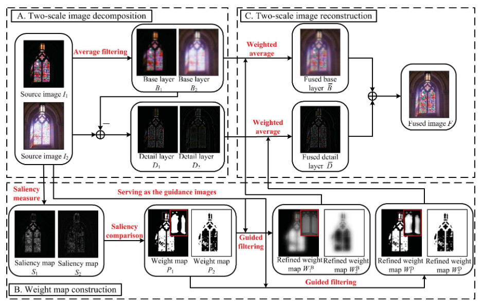

# Image fusion using wavelet transform

Hans Brouwer & Aggariyo Wanagiri

```bash
pip install -r requirements.txt
python guided_filter_fuse.py stained-glass-dark.png stained-glass-light.png
```

## [Image fusion with guided filtering](https://www.researchgate.net/profile/Shutao-Li-2/publication/235392779_Image_Fusion_With_Guided_Filtering/links/563720f808aeb786b7042cd2/Image-Fusion-With-Guided-Filtering.pdf)

- Guided filter
  - Filter output = linear transformation of guidance image in local window
    - `O = a * I[w] + b for w in windows(I)`
  - Linear coefficients estimated by minimizing squared difference b/w output and input image
    - Can solve directly with linear regression
    - `a = sum(I[w] * P[w] - mean(I[w]) * mean(P[w])) / (len(w) * (var(I[w]) + eps))`
    - `b = mean(P[w]) - a * mean(I[w])`
  - Naively, this causes value of output pixel values (O_i) to change in different windows
    - => Pre-calculate all a & b and then average for each window
    - `a_bar = sum(a_k for k in w) / len(w)`, `b_bar = sum(b_k for k in w) / len(w)`
- Image fusion
  1. Compute two-scale representations of images by average filtering
     - B_n = conv(I_n, Z) with Z = 31x31 average filter
     - D_n = I_n - B_n
  2. Construct weight map
     - H_n = conv(I_n, L) with L = 3x3 Laplacian filter
     - S_n = conv(abs(H_N), g) with g = (2r_g+1)x(2r_g+1) Gaussian low-pass with std. dev. = sig_g
     - `P_n[k] = 1 if S_n[k] == max(S_i[k] for i in n) else 0`
  3. Realign weight maps using spatial consistency
     - Guided filter on weight map with source image as guide
     - W_n = GuidedFilter(P_n, I_n) for B and D
     - Normalize weight maps to sum to 1
  4. Weighted average of base and detail images with respective weight maps, sum base and detail to final output



- Evaluation metrics
  - [Normalized mutual information](https://scikit-learn.org/stable/modules/generated/sklearn.metrics.normalized_mutual_info_score.html)
  - [Structural similarity (SSIM)](https://scikit-image.org/docs/dev/api/skimage.metrics.html#structural-similarity)
  - Cveijic's Metric / [UIQI](https://github.com/andrewekhalel/sewar)
  - Gradient based index
  - Phase congruency

## [Multi-sensor image fusion using the wavelet transform](https://vision.ece.ucsb.edu/sites/default/files/publications/94ICIPWav.pdf)

- Image fusion
  1. Calculate wavelet transform
  2. At each resolution and point in the image take the max of coefficients
     - Naively taking pixel-by-pixel max doesn't necessarily preserve most relevant info
     - Instead:
       1. Decompose image into gradient pyramid
       2. Calculate variance in image over 3x3 and 5x5 windows
       3. If variance acitivities are close: average, else: take max of two
       4. Binarize over images based on max activity value
  3. Majority filter on binary weighting
     - Majority filter, negate, majority filter, negate
  4. Apply binary map to wavelets and transform back to image 
